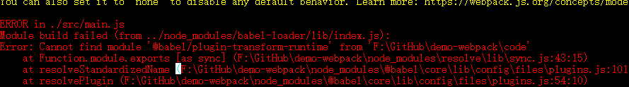
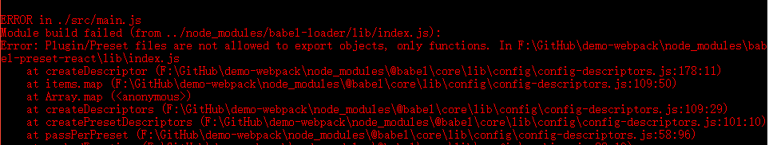
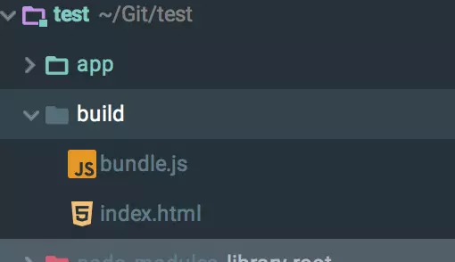

1 code目录为存在代码和执行的目录，

 webpack11-29官方更新后的一个demo： https://github.com/sbwxffnhc/webpack-demo

#### 1. 全局安装webpack

~~~
//全局安装
npm install -g webpack
//安装到你的项目目录（先npm init，往下看就知道）
npm install --save-dev webpack
~~~

#### 2. 正式使用Webpack前的准备

1. npm init -y

生成 pakage.json文件如下：

```
{
  "name": "webpack",
  "version": "1.0.0",
  "description": "> 2018年11月29日更新，目前 webpack 已经更新值 4.26.1 ，本文所用到的各种库或多或少有些过时，跟着代码操作下来可能会遇到各种问题，不过 webpack 的主体思想没变，所以还是希望本文对新学 webpack 的你，有所帮助。此外用基于 webpack 4.26.1 [写了一个简单的demo，如果遇到啥问题，可以参考](https://github.com/Val-Zhang/webpack-demo-client)，之后应该会逐步来完善这个demo，如果有啥通用的想实现的功能，也可以在里面提 issue。",
  "main": "index.js",
  "scripts": {
    "test": "echo \"Error: no test specified\" && exit 1"
  },
  "repository": {
    "type": "git",
    "url": "git+https://github.com/sbwxffnhc/webpack.git"
  },
  "keywords": [],
  "author": "",
  "license": "ISC",
  "bugs": {
    "url": "https://github.com/sbwxffnhc/webpack/issues"
  },
  "homepage": "https://github.com/sbwxffnhc/webpack#readme"
}

```

2. package.json文件已经就绪，我们在本项目中安装Webpack作为依赖包

```
文件夹名不要与webpack重
// 安装Webpack
npm install --save-dev webpack
```

3. 这里是执行的vue程序，所以要安装vue: `npm i --save vue`


####　3. 正式使用Webpack

 通过配置文件来使用webpack

在当前练习文件夹的根目录下新建一个名为`webpack.config.js`的文件，我们在其中写入如下所示的简单配置代码，目前的配置主要涉及到的内容是入口文件路径和打包后文件的存放路径。

~~~
const pathlib=require('path');

module.exports={
  entry: './app/main',
  output: {
    path: pathlib.resolve('public'),
    filename: 'bundle.js'
  }
};
~~~

> **注**：“__dirname”是node.js中的一个全局变量，它指向当前执行脚本所在的目录。

有了这个配置之后，再打包文件，只需在终端里运行`webpack(非全局安装需使用node_modules/.bin/webpack)`命令就可以了，这条命令会自动引用`webpack.config.js`文件中的配置选项，配合配置文件进行打包


#### 4. 更快捷的执行打包任务

在命令行中输入命令需要代码类似于`node_modules/.bin/webpack`这样的路径其实是比较烦人的，不过值得庆幸的是`npm`可以引导任务执行，对`npm`进行配置后可以在命令行中使用简单的`npm start`命令来替代上面略微繁琐的命令。在`package.json`中对`scripts`对象进行相关设置即可，设置方法如下。

```
{
  "name": "webpack-sample-project",
  "version": "1.0.0",
  "description": "Sample webpack project",
  "scripts": {
    "start": "webpack" // 修改的是这里，JSON文件不支持注释，引用时请清除
  },
  "author": "zhang",
  "license": "ISC",
  "devDependencies": {
    "webpack": "3.10.0"
  }
}
```

> **注：**`package.json`中的`script`会安装一定顺序寻找命令对应位置，本地的`node_modules/.bin`路径就在这个寻找清单中，所以无论是全局还是局部安装的Webpack，你都不需要写前面那指明详细的路径了。

~~~
npm start
~~~


==>   当code为执行目录，其上级为`node_modules`目录，此时，在code目录里面添加一个package.json文件,   如果再要安装其他东西，就应当到code目录的上级目录去安装，不然npm会因package.json文件的存在误认为要安装在本目录下

~~~
{
  "scripts": {
	"start": "webpack",
    "server": "..\\node_modules\\.bin\\webpack-dev-server --open"
  }
}
~~~


#### 5. Webpack的强大功能

##### 生成Source Maps（使调试更容易）

对小到中型的项目中，`eval-source-map`是一个很好的选项，再次强调你只应该开发阶段使用它，我们继续对上文新建的`webpack.config.js`，进行如下配置:

```
module.exports = {
  devtool: 'eval-source-map',
  entry:  __dirname + "/app/main.js",
  output: {
    path: __dirname + "/public",
    filename: "bundle.js"
  }
}
```

#### 6. 使用webpack构建本地服务器

想不想让你的浏览器监听你的代码的修改，并自动刷新显示修改后的结果，其实`Webpack`提供一个可选的本地开发服务器，这个本地服务器基于node.js构建，可以实现你想要的这些功能，不过它是一个单独的组件，在webpack中进行配置之前需要单独安装它作为项目依赖

```
npm install --save-dev webpack-dev-server
```

devserver作为webpack配置选项中的一项，以下是它的一些配置选项，更多配置可参考[这里](https://webpack.js.org/configuration/dev-server/)

](https://webpack.js.org/configuration/dev-server/)

| devserver的配置选项 | 功能描述                                                     |
| ------------------- | ------------------------------------------------------------ |
| contentBase         | 默认webpack-dev-server会为根文件夹提供本地服务器，如果想为另外一个目录下的文件提供本地服务器，应该在这里设置其所在目录（本例设置到“public"目录） |
| port                | 设置默认监听端口，如果省略，默认为”8080“                     |
| inline              | 设置为`true`，当源文件改变时会自动刷新页面                   |
| historyApiFallback  | 在开发单页应用时非常有用，它依赖于HTML5 history API，如果设置为`true`，所有的跳转将指向index.html |

把这些命令加到webpack的配置文件中，现在的配置文件`webpack.config.js`如下所示

```
const pathlib=require('path');

module.exports={
  entry: './app/main',
  output: {
    path: pathlib.resolve('public'),
    filename: 'bundle.js'
  },
  devtool: 'eval-source-map',
  
  devServer: {
    contentBase: "./public",//本地服务器所加载的页面所在的目录
    historyApiFallback: true,//不跳转
    inline: true//实时刷新
  } 
};

```

在`package.json`中的`scripts`对象中添加如下命令，用以开启本地服务器：

```
  {
  "scripts": {
    "test": "echo \"Error: no test specified\" && exit 1",
	"start": "webpack",
    "server": "..\\node_modules\\.bin\\webpack-dev-server --open"
  }
}
```

在终端中输入`npm run server`即可在本地的`8080`端口查看结果

~~~
npm run server
~~~


#### 7. 配置Loaders

 `Loaders`是`webpack`提供的最激动人心的功能之一了。通过使用不同的`loader`，`webpack`有能力调用外部的脚本或工具，实现对不同格式的文件的处理，比如说分析转换scss为css，或者把下一代的JS文件（ES6，ES7)转换为现代浏览器兼容的JS文件，对React的开发而言，合适的Loaders可以把React的中用到的JSX文件转换为JS文件。

Loaders需要单独安装并且需要在`webpack.config.js`中的`modules`关键字下进行配置，Loaders的配置包括以下几方面：

- `test`：一个用以匹配loaders所处理文件的拓展名的正则表达式（必须）
- `loader`：loader的名称（必须）
- `include/exclude`:手动添加必须处理的文件（文件夹）或屏蔽不需要处理的文件（文件夹）（可选）；
- `query`：为loaders提供额外的设置选项（可选）

 

#### 7.1 Babel的配置

文档：https://webpack.docschina.org/loaders/babel-loader/

##### 安装 

> webpack 3.x | babel-loader 8.x | babel 7.x

```
//npm install babel-loader@8.0.0-beta.0 @babel/core @babel/preset-env webpack --save-dev
npm i babel-preset-react --save-dev
npm install --save-dev babel-core babel-loader babel-preset-env babel-preset-react


```


1 这些安装有时也乱了套，会出现版本不兼容的情况，所以可以根据出现的bug提示要安装的模块，如

Error: Cannot find module '@babel/plugin-transform-runtime' from 'F:\GitHub\demo-webpack\code'

npm i @babel/plugin-transform-runtime --save-dev


2 如果在你的 package.json 依赖包中既有 babel 7.0 版本，又有 babel 6.0 版本，就会报这个错误

　　很现实就是两个版本是不兼容的



Babel乱了

Babel其实可以完全在 `webpack.config.js` 中进行配置，但是考虑到babel具有非常多的配置选项，在单一的`webpack.config.js`文件中进行配置往往使得这个文件显得太复杂，因此一些开发者支持把babel的配置选项放在一个单独的名为 ".babelrc" 的配置文件中。我们现在的babel的配置并不算复杂，不过之后我们会再加一些东西，因此现在我们就提取出相关部分，分两个配置文件进行配置（webpack会自动调用`.babelrc`里的babel配置选项），如下：

```
module.exports = {
    entry: __dirname + "/app/main.js",//已多次提及的唯一入口文件
    output: {
        path: __dirname + "/public",//打包后的文件存放的地方
        filename: "bundle.js"//打包后输出文件的文件名
    },
    devtool: 'eval-source-map',
    devServer: {
        contentBase: "./public",//本地服务器所加载的页面所在的目录
        historyApiFallback: true,//不跳转
        inline: true//实时刷新
    },
    module: {
        rules: [
            {
                test: /(\.jsx|\.js)$/,
                use: {
                    loader: "babel-loader"
                },
                exclude: /node_modules/
            }
        ]
    }
};
```

```
//.babelrc
{
  "presets": ["react", "env"]
}
```

到目前为止，我们已经知道了，对于模块，Webpack能提供非常强大的处理功能，那那些是模块呢。

 

 #### 7.2 vue-loader

文档：https://www.npmjs.com/package/vue-loader

​           https://loulanyijian.github.io/vue-loader-doc-Chinese/

~~~
npm i vue-loader --save-dev
npm i vue-template-compiler --save-dev
~~~

vue-loader@15.*之后除了必须带有VueLoaderPlugin
解决方案： 
需要使用插件VueLoaderPlugin 
在webpack.config.js里用const VueLoaderPlugin = require('vue-loader/lib/plugin')引入， 
然后在module.exports对象里添加plugins:[new VueLoaderPlugin()] 

~~~
const pathlib=require('path');
const VueLoaderPlugin = require('vue-loader/lib/plugin')

module.exports={
  entry: './app/main',
  output: {
    path: pathlib.resolve('public'),
    filename: 'bundle.js'
  },
  devtool: 'eval-source-map',
  
  devServer: {
    contentBase: "./public",//本地服务器所加载的页面所在的目录
    historyApiFallback: true,//不跳转
    inline: true//实时刷新
  },
  module:{
  	rules:[
	  	{//解析vue
	        test:/\.vue$/,
	        loader:'vue-loader'//vue-template-compiler是代码上的依赖
	  	},
		{
			test: /\.css$/,
			use: [
				{
					loader: "style-loader"
				}, {
					loader: "css-loader"
				}
			]
		}
  	]
  },
   plugins: [
	   new VueLoaderPlugin()
   ]
};
~~~


然后如果添加了插件还是报错如下错误的话，表示不能处理.vue文件里<style>的部分，还要添加vue-style-loader来处理 (跳转到下节)

 #### 7.3 CSS模块

webpack提供两个工具处理样式表，`css-loader` 和 `style-loader`，二者处理的任务不同，`css-loader`使你能够使用类似`@import` 和 `url(...)`的方法实现 `require()`的功能,`style-loader`将所有的计算后的样式加入页面中，二者组合在一起使你能够把样式表嵌入webpack打包后的JS文件中。

~~~
//安装
npm install --save-dev style-loader css-loader
~~~

~~~
//使用
module.exports = {

   ...
    module: {
        rules: [
            {
                test: /(\.jsx|\.js)$/,
                use: {
                    loader: "babel-loader"
                },
                exclude: /node_modules/
            },
            {
                test: /\.css$/,
                use: [
                    {
                        loader: "style-loader"
                    }, {
                        loader: "css-loader"
                    }
                ]
            }
        ]
    }
};
~~~

#### 7.4 CSS预处理器

`Sass` 和 `Less` 之类的预处理器是对原生CSS的拓展，它们允许你使用类似于`variables`, `nesting`, `mixins`, `inheritance`等不存在于CSS中的特性来写CSS，CSS预处理器可以这些特殊类型的语句转化为浏览器可识别的CSS语句，

你现在可能都已经熟悉了，在webpack里使用相关loaders进行配置就可以使用了，以下是常用的CSS 处理`loaders`:

- `Less Loader`
- `Sass Loader`
- `Stylus Loader`

不过其实也存在一个CSS的处理平台`-PostCSS`，它可以帮助你的CSS实现更多的功能，在其[官方文档](https://github.com/postcss/postcss)可了解更多相关知识。

举例来说如何使用PostCSS，我们使用PostCSS来为CSS代码自动添加适应不同浏览器的CSS前缀。

首先安装`postcss-loader` 和 `autoprefixer`（自动添加前缀的插件）

```
npm install --save-dev postcss-loader autoprefixer
```

接下来，在webpack配置文件中添加`postcss-loader`，在根目录新建`postcss.config.js`,并添加如下代码之后，重新使用`npm start`打包时，你写的css会自动根据Can i use里的数据添加不同前缀了。

```
//webpack.config.js
module.exports = {
    ...
    module: {
        rules: [
            {
                test: /(\.jsx|\.js)$/,
                use: {
                    loader: "babel-loader"
                },
                exclude: /node_modules/
            },
            {
                test: /\.css$/,
                use: [
                    {
                        loader: "style-loader"
                    }, {
                        loader: "css-loader",
                        options: {
                            modules: true
                        }
                    }, {
                        loader: "postcss-loader"
                    }
                ]
            }
        ]
    }
}
```

```
// postcss.config.js
module.exports = {
    plugins: [
        require('autoprefixer')
    ]
}
```

至此，本文已经谈论了处理JS的Babel和处理CSS的PostCSS的基本用法，它们其实也是两个单独的平台，配合`webpack`可以很好的发挥它们的作用。接下来介绍Webpack中另一个非常重要的功能-`Plugins`

####  8. 插件（Plugins）

插件（Plugins）是用来拓展Webpack功能的，它们会在整个构建过程中生效，执行相关的任务。
 Loaders和Plugins常常被弄混，但是他们其实是完全不同的东西，可以这么来说，loaders是在打包构建过程中用来处理源文件的（JSX，Scss，Less..），一次处理一个，插件并不直接操作单个文件，它直接对整个构建过程其作用。

Webpack有很多内置插件，同时也有很多第三方插件，可以让我们完成更加丰富的功能。

#### 使用插件的方法

要使用某个插件，我们需要通过`npm`安装它，然后要做的就是在webpack配置中的plugins关键字部分添加该插件的一个实例（plugins是一个数组）

#### HtmlWebpackPlugin

这个插件的作用是依据一个简单的`index.html`模板，生成一个自动引用你打包后的JS文件的新`index.html`。这在每次生成的js文件名称不同时非常有用（比如添加了`hash`值）。

**安装**

```
npm install --save-dev html-webpack-plugin
```


更新`webpack`的配置文件，方法同上,新建一个`build`文件夹用来存放最终的输出文件

```
const webpack = require('webpack');
const HtmlWebpackPlugin = require('html-webpack-plugin');

module.exports = {
    entry: __dirname + "/app/main.js",//已多次提及的唯一入口文件
    output: {
        path: __dirname + "/build",
        filename: "bundle.js"
    },
    devtool: 'eval-source-map',
    devServer: {
        contentBase: "./public",//本地服务器所加载的页面所在的目录
        historyApiFallback: true,//不跳转
        inline: true//实时刷新
    },
    module: {
        rules: [
            {
                test: /(\.jsx|\.js)$/,
                use: {
                    loader: "babel-loader"
                },
                exclude: /node_modules/
            },
            {
                test: /\.css$/,
                use: [
                    {
                        loader: "style-loader"
                    }, {
                        loader: "css-loader",
                        options: {
                            modules: true
                        }
                    }, {
                        loader: "postcss-loader"
                    }
                ]
            }
        ]
    },
    plugins: [
        new webpack.BannerPlugin('版权所有，翻版必究'),
        new HtmlWebpackPlugin({
            template: __dirname + "/app/index.tmpl.html"//new 一个这个插件的实例，并传入相关的参数
        })
    ],
};

```

再次执行`npm start`你会发现，build文件夹下面生成了`bundle.js`和`index.html`。

 

build文件夹

 

 参考文章：https://www.jianshu.com/p/42e11515c10f

参考文档：./webpack.md